# RENTAL PULSE MANAGEMENT  |  Powered by Microsoft Fabric Real-Time Intelligence & AI

  - [1.1. Overview](#11-overview)
  - [1.2. Architecture Overview](#12-architecture-overview)
  - [1.3. Prerequisites](#13-prerequisites)
  - [1.4. Channel Manager Simulator](#14-channel-manager-simulator)
    - [1.4.1. Logic](#141-logic)
    - [1.4.2. Setting up Function App](#142-setting-up-function-app)
  - [1.5. Real-time events processing](#15-real-time-events-processing)
    - [1.5.1. Logic](#151-logic)
    - [1.5.2. Setting up Eventstream](#152-setting-up-eventstream)
    - [1.5.3. Setting up Eventhouse](#153-setting-up-eventhouse)
    - [1.5.4. Creating KQL queries - Copilot assistance](#154-creating-kql-queries---copilot-assistance)
      - [1.5.4.1. Table with latest reservation's status](#1541-table-with-latest-reservations-status)
      - [1.5.4.2. Semantic model - `fct_reservations`](#1542-semantic-model---fct_reservations)
      - [1.5.4.3. Semantic model - `fct_cleaning_schedule`](#1543-semantic-model---fct_cleaning_schedule)
      - [1.5.4.4. Semantic model - `fct_weekly_summary`](#1544-semantic-model---fct_weekly_summary)
  - [1.6. Lakehouse](#16-lakehouse)
    - [1.6.1. Logic](#161-logic)
    - [1.6.2. Setting up Lakehouse](#162-setting-up-lakehouse)
  - [1.7. Semantic model](#17-semantic-model)
    - [1.7.1. Logic](#171-logic)
    - [1.7.2. Setting up Semantic Model](#172-setting-up-semantic-model)
  - [1.8. Power BI Report with Power Automate](#18-power-bi-report-with-power-automate)
    - [1.8.1. Logic](#181-logic)
    - [1.8.2. Setting up report: page refresh](#182-setting-up-report-page-refresh)
    - [1.8.3. Creating visuals](#183-creating-visuals)
    - [1.8.4. Adding *Narrative* powered by Copilot](#184-adding-narrative-powered-by-copilot)
    - [1.8.5. Adding Power Automate Flow:  Real-Time Cleaner Assignment](#185-adding-power-automate-flow--real-time-cleaner-assignment)
  - [1.9. Summary](#19-summary)
  - [1.10. Authors](#110-authors)
  - [1.11. References](#111-references)

## 1.1. Overview
Inspiration for this use case comes from a common business model in European tourist cities: property-management firms that operate ~30–100+ short- and mid-term rentals. Running this portfolio requires integrating many external data sources and reacting to real-time signals—equipment failures, cleaning-team staffing gaps, last-minute guest changes, or individual inquiries. Off-the-shelf apps are typically tailored to a narrow property profile, while real operations demand far greater flexibility. For stable, growth-oriented businesses, advanced analytics are equally important: mining historical performance and reviews, and enriching decisions with weather forecasts, city events, and more. In this scenario, we deliberately showcase a small set of the most impactful capabilities from our perspective, while keeping in mind the solution’s broad potential and a rich roadmap for subsequent phases. Because Microsoft Fabric offers both rapid start-up and a scalable path for future expansion, we chose it — specifically Fabric Real-Time Intelligence and AI — as the foundation for this solution.

---
## 1.2. Architecture Overview
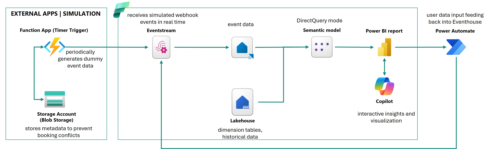

The solution integrates external applications with Microsoft Fabric using Azure serverless components. Data ingestion begins when external systems send real-time data payloads via a webhook to an **Azure Function App**. The Function App acts as an event-driven entry point, validating incoming requests, performing lightweight transformations, and publishing the data to a Fabric **Eventstream**. 

The ingested data is streamed to a **KQL database** within the **Eventhouse**, providing low-latency access for real-time analytics and dashboards. In parallel, dimension tables and other slowly changing datasets are stored and maintained in the **Lakehouse**.

A **semantic model** operating in DirectQuery mode combines both sources — the KQL Database (real-time events) and the Lakehouse (reference and historical data). This unified model enables seamless analytics across both datasets.
The **Power BI report** (with auto page refresh enabled) built on this model includes a **Copilot-powered Narrative** that automatically generates textual insights based on visualizations. Furthermore, **Power Automate** workflows enable users to input new data, which is then ingested into the Eventhouse.

In this demo, the behavior of external application, like Channel Manager, is simulated using an Azure Function App. The Function App includes a timer trigger that periodically generates dummy event data and sends it to the Event Stream, replicating real-time webhook data ingestion.

To maintain data consistency and prevent booking date conflicts, the Function App also uses an **Azure Storage Account (Blob Storage)** to persist key information about previously generated events. This ensures that each new simulated event is validated against existing records, maintaining logical integrity throughout the data stream.

---
## 1.3. Prerequisites 
- Active **Azure Subscription**  
- **Microsoft Fabric Capacity** enabled 
- Active **Power Automate Premium**

- [Azure Portal](https://portal.azure.com):
   -  Go to *Function App* and create new app service. You can choose the *Consumption* hosting option for this demo.
   -  Go to *Storage Account* and create a new one. In the left-hand menu, navigate to *Data storage* > *Containers*, then select *Add container* to add a new container. 
- [Microsoft Fabric](https://app.fabric.microsoft.com):
  - Create new items:
    -  *Eventstream* with custom endpoint as a source
    -  *Eventhouse*
    -  *Lakehouse*
---
## 1.4. Channel Manager Simulator
### 1.4.1. Logic
The Function App uses the **Timer Trigger** to run at regular intervals.  
Each execution generates dummy booking events and checks **Blob Storage** for previously stored metadata to ensure data consistency (e.g. avoiding overlapping bookings).  
After validation, the event payloads are sent to the **Fabric Eventstream**, simulating real-time webhook ingestion.

### 1.4.2. Setting up Function App
Visual Studio Code:
1. Install extensions: *Azure Functions* and *Azure Functions Core Tools*.
2. Go to *Azure* tab. In the workspace, click Azure Functions icon and select *Create Function* .

   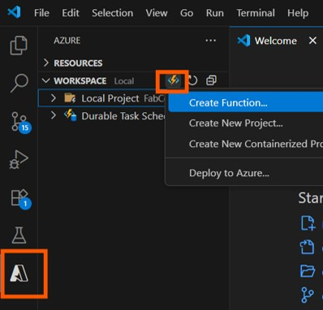
3. Select empty folder for your project, select *python*, select *Timer Trigger* as template and enter cron expression to specify the schedule (for example, "0 */1 * * * *" to run every minute).
4. Go to *Explorer* tab to see your project's files.
   
    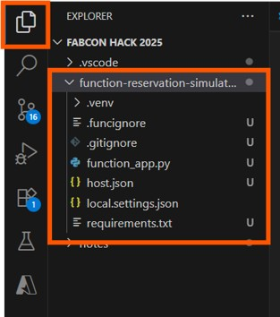
5. Upload [function_app.py](./resources/00%20Function%20App/function_app.py) and [requirements.txt](./resources/00%20Function%20App/requirements.txt) files.
6. Go to *local.settings.json* and add following parameters:
   - "EVENTHUB_CONN_STR": `<your-eventstream-custom-endpoint-connection-string>`,
   - "BLOB_CONN_STR": `<your-storage-account-connection-string>`,
   - "BLOB_CONTAINER": `<your-container-name>`,
   - "BLOB_FILE_ALL": "apartments_booking_summary.json",
   - "BLOB_FILE_MODIFY":"full_events_to_modify.json",
   - "EVENTS_PER_TICK": "4",
   - "SEED": "55"
7. Go to *Azure tab > Resources > Azure subscription > Function App*, right click on your function name and choose *Deploy to Function App*. 

    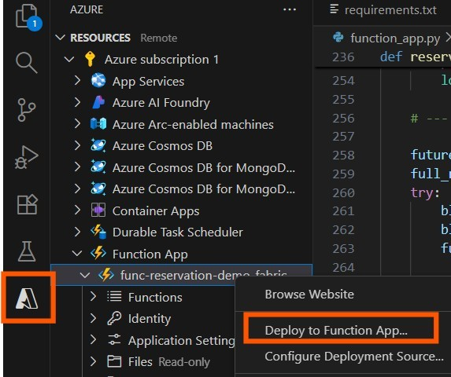
   
8. Go to [Azure Portal](https://portal.azure.com). Navigate to *Funtion App* > `<your function name>`. In the left-hand menu, navigate to *Settings* > *Environment variables* and update the list of variables to match those you added to `local.setting.json`. Add `AzureWebJobsStorage: <your-storage-account-connection-string>`.

   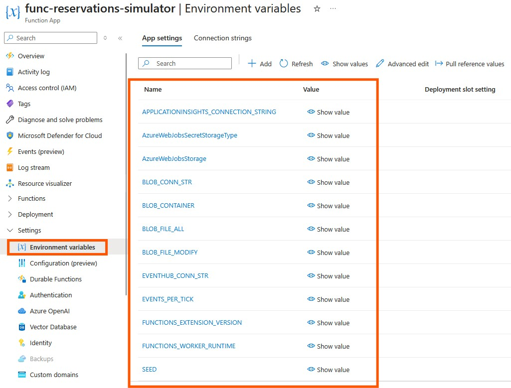
9.  Your function is running — that means customers are making reservations! Let’s move on to streaming data with Eventstream.

## 1.5. Real-time events processing
### 1.5.1. Logic
In our solution, the **Eventstream** is designed to receive inputs from multiple applications. Therefore, we want to route the incoming data to different destinations within the **Eventhouse**, depending on the input schema. The **Eventhouse** stores raw booking events (new, cancelled, modified) as well as operational data, such as `cleaners_workload` (loaded from a sample CSV file in this demo and updated through **Power Automate** workflows). The semantic model, in turn, requires transformed data — such as the current number of occupied and available properties — which we prepared using **KQL queries** created with the help of **Copilot**.

### 1.5.2. Setting up Eventstream
1. Go to the **Eventstream** you created before. Navigate to *Settings* (gear icon) > *Schema* and enable *Multiple schema inferencing*. You should see now *Inferred schema* tab when you select the stream tile. 
2. Add step *Transform Events* > *Manage fields*. Select *Input schema* name and click *Add all fields*. Set *arrival, departure, created_at, modified_at* as a datetime.

   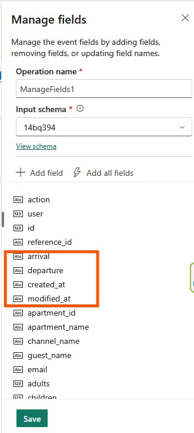

3. Add step *Add Destination*. Choose Eventhouse you created before and define new tables named *reservations*.
   
   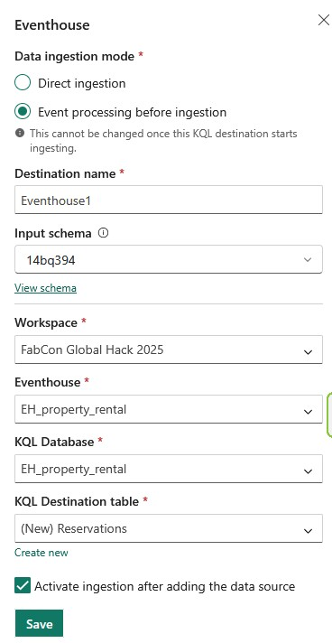 

### 1.5.3. Setting up Eventhouse
1.  Go to the **Eventhouse** you created before. Upload CSV file from the folder `/resources/01 Eventhouse`
   
   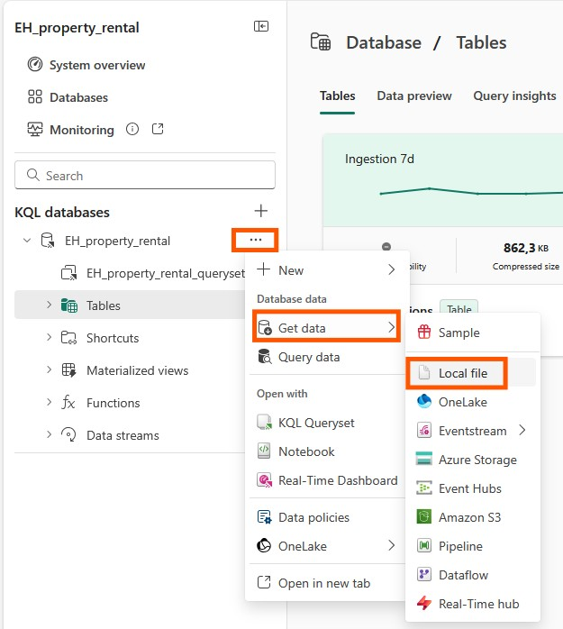 

1. Add a new table as a destination and choose datetime for `shift_start` and `shift_end`.

   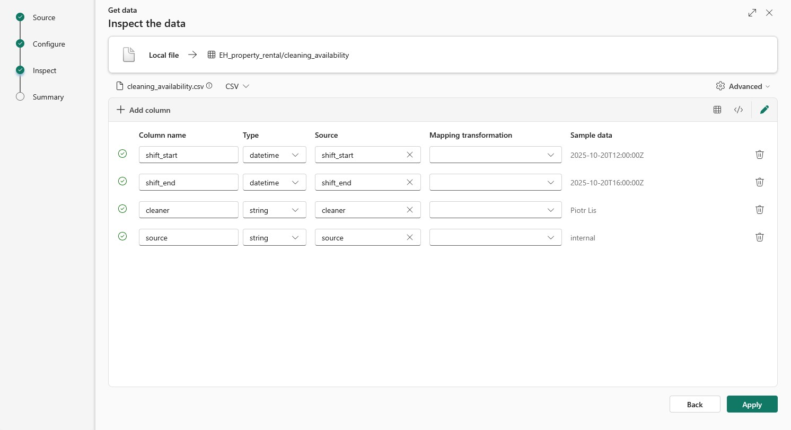

### 1.5.4. Creating KQL queries - Copilot assistance
To simplify query creation, we used **Copilot in KQL Queryset** to generate an initial version of the KQL code.  
Below is the original prompt followed by the final, corrected query.

#### 1.5.4.1. Table with latest reservation's status 
**Prompt to Copilot:**
>Write a KQL query that returns the latest reservation record for each reference_id. Each reservation has multiple events with an action column (newReservation, modifyReservation, cancelReservation) and a modified_at timestamp. If multiple actions occur at the exact same timestamp, use a priority rule: cancelReservation > modifyReservation > newReservation. Return the full record (all columns) of the latest status per reference_id.

**Final KQL query (after manual adjustments):**

<pre>
reservations
| extend action_priority = case(
    action == "cancelReservation", 3,
    action == "modifyReservation", 2,
    action == "newReservation", 1,
    0
)
| summarize arg_max(action_priority, *) by reference_id
</pre>

#### 1.5.4.2. Semantic model - `fct_reservations`

**Prompt to Copilot:**
>Use the following query for table bookings: 'reservations | extend action_priority = case( action == "cancelReservation", 3, action == "modifyReservation", 2, action == "newReservation", 1, 0 ) | summarize arg_max(action_priority, *) by reference_id'. Get status for reservations within a time window from one week ago up to two weeks ahead from today.
Make sure the time filter uses the current date (now) and selects rows where either arrival or departure is within that window.
Add fields: "is_closed" (for non cancelled reservations with departure in the past), "is_cancelled", "is_occupied" (for ongoing reservations), "is_reserved" (for future reservations)

**Final KQL query (after manual adjustments):**
<pre>
reservations
| extend action_priority = case(
    action == "cancelReservation", 3,
    action == "modifyReservation", 2,
    action == "newReservation", 1,
    0
)
| summarize arg_max(action_priority, *) by reference_id
| extend
    checkin_date = todatetime(arrival),
    checkout_date = todatetime(departure),
    is_cancelled = action == "cancelReservation"
| where (checkin_date >= startofday(now() - 7d) and checkin_date <= endofday(now() + 14d))
    or (checkout_date >= startofday(now() - 7d) and checkout_date <= endofday(now() + 14d))
| extend
    is_closed = not(is_cancelled) and checkout_date < now(),
    is_occupied = not(is_cancelled) and checkin_date <= now() and checkout_date > now(),
    is_reserved = not(is_cancelled) and checkin_date > now()
| project
    reservation_id = reference_id,
    apartment_id,
    channel = channel_name,
    checkin_date,
    checkout_date,
    is_cancelled,
    is_closed,
    is_occupied,
    is_reserved,
    adults,
    children,
    price,
    prepayment,
    deposit
</pre>

#### 1.5.4.3. Semantic model - `fct_cleaning_schedule`
**Prompt to Copilot:**

>Use the following query for table bookings: 'reservations | extend action_priority = case( action == "cancelReservation", 3, action == "modifyReservation", 2, action == "newReservation", 1, 0 ) | summarize arg_max(action_priority, *) by reference_id | where not(action == "cancelReservation")'
For each apartment, find the time until the next reservation. Use only reservations with departure this week starting today. Assume check-in time is 4 p.m. and check-out time is 12 p.m. Calculate the time gap between the current departure and the next arrival. Add a column status with these rules: if the gap is less than or equal to 4 hours, set status to "high"; if between 4 and 8 hours, set status to "medium"; and if greater than 8 hours, set status to "low".

**Final KQL query (after manual adjustments):**

<pre>
let CurrentWeekReservations =
    reservations
    | extend action_priority = case(
        action == "cancelReservation", 3,
        action == "modifyReservation", 2,
        action == "newReservation", 1,
        0
    )
    | summarize arg_max(action_priority, *) by reference_id
    | where not(action == "cancelReservation")
    | extend
        checkin_date = todatetime(arrival),
        departure_date = todatetime(departure)
    | where departure_date >= startofday(now())
        and departure_date < startofday(now() + 7d)
    | extend
        checkin_dt = datetime_add('hour', 16, checkin_date),   // check-in always 16:00
        checkout_dt = datetime_add('hour', 12, departure_date) // check-out always 12:00
    | project
        reservation_id = reference_id,
        apartment_id = tostring(apartment_id),
        apartment = apartment_name,
        checkin_dt,
        checkout_dt
;
// Prepare same table for join (right side)
let ReservationsForJoin =
    reservations
    | extend action_priority = case(
        action == "cancelReservation", 3,
        action == "modifyReservation", 2,
        action == "newReservation", 1,
        0
    )
    | summarize arg_max(action_priority, *) by reference_id
    | where not(action == "cancelReservation")
    | extend
        checkin_date = todatetime(arrival)
    | extend
        checkin_dt_B = datetime_add('hour', 16, checkin_date),
        apartment_id = tostring(apartment_id),
        reference_id_B = reference_id
    | project apartment_id, checkin_dt_B, reference_id_B
;
// Join to find next reservation per apartment
let Joined =
    CurrentWeekReservations
    | join kind=leftouter ReservationsForJoin on apartment_id
    | where checkin_dt_B > checkout_dt
    | summarize
        next_checkin_dt = min(checkin_dt_B),
        next_ref = any(reference_id_B)
        by reservation_id,
           apartment_id,
           apartment,
           checkin_dt,
           checkout_dt
;
// Calculate time gap and status
Joined
| extend
    time_gap_hours = datetime_diff('hour', next_checkin_dt, checkout_dt)
| extend
    status = case(
        isnull(time_gap_hours), "low",
        time_gap_hours <= 4, "high",
        time_gap_hours <= 8, "medium",
        "low"
    )
| project
    apartment_id,
    apartment,
    reservation_id,
    cleaning_start = checkout_dt,
    cleaning_end = next_checkin_dt,
    time_gap_hours,
    cleaning_priority = status
| order by apartment_id asc, cleaning_start asc
</pre>

#### 1.5.4.4. Semantic model - `fct_weekly_summary`
**Prompt to Copilot:**
>Use the following query for table bookings: 'reservations | extend action_priority = case( action == "cancelReservation", 3, action == "modifyReservation", 2, action == "newReservation", 1, 0 ) | summarize arg_max(action_priority, *) by reference_id'. Summarize occupancy, forward bookings, average daily rates, cancellations, and stay length on a weekly basis. When calculating average daily rates and occupancy, make sure to include the length of stay in the computation.

**Final KQL query (after manual adjustments):**

<pre>
reservations
| extend action_priority = case(
    action == "cancelReservation", 3,
    action == "modifyReservation", 2,
    action == "newReservation", 1,
    0
)
| summarize arg_max(action_priority, *) by reference_id
| extend
    checkin_date = todatetime(arrival),
    checkout_date = todatetime(departure),
    is_cancelled = action == "cancelReservation",
    stay_length = datetime_diff('day', todatetime(departure), todatetime(arrival)),
    week = startofweek(todatetime(arrival))
| summarize
    occupancy_nights=sumif(stay_length, not(is_cancelled)),
    forward_bookings_nights=sumif(stay_length, not(is_cancelled) and todatetime(arrival) > now()),
    avg_daily_rate=avgif(price / stay_length, not(is_cancelled) and stay_length > 0),
    cancellations_count=countif(is_cancelled),
    avg_stay_length=avgif(stay_length, not(is_cancelled) and stay_length > 0)
    by week
| order by week asc
</pre>

## 1.6. Lakehouse
### 1.6.1. Logic
In our demo, the **Lakehouse** serves as a source of dimension data loaded from CSV files. These files represent simplified datasets used for demonstration purposes. In a real-world scenario, such data would typically originate from property management systems, CRM platforms, or pricing and availability databases. The dimension tables change infrequently and provide descriptive context for the booking events stored in the Eventhouse, supporting the semantic model used for analysis.

### 1.6.2. Setting up Lakehouse
1. Go to the **Lakehouse** you created before. Upload CSV files from the folder `/resources/02 Lakehouse`.

   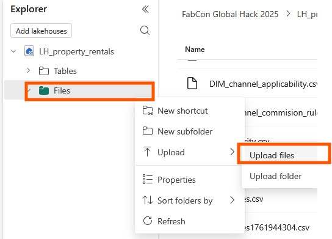 
1. Load each file to a new table. **Important:** the CSV files are semicolon-separated.

   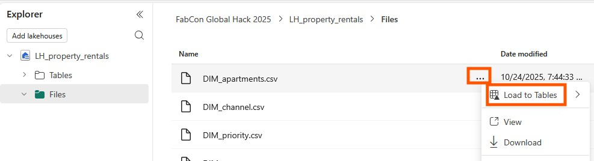 

## 1.7. Semantic model

### 1.7.1. Logic
The **Semantic Model** combines data from both the KQL database and the Lakehouse using **DirectQuery mode**. This setup enables real-time insights from streaming booking events, enriched with operational data related to property cleaning. As a result, the model provides a unified analytical layer that supports Power BI reporting, allowing users to explore occupancy rates, availability, and booking trends in near real time.

### 1.7.2. Setting up Semantic Model
1. Open Power BI Desktop, go to *Get data* > *KQL databases*, connect to your KQL database. Select `cleaners_workload` table, and click *Transform data* to open Power Query editor. Choose DirectQuery mode.
2. In Power Query Editor, right-click on query name and click *Duplicate*. Keep only *Source* step in duplicated query. Then click on gear icon next to *Source*.

   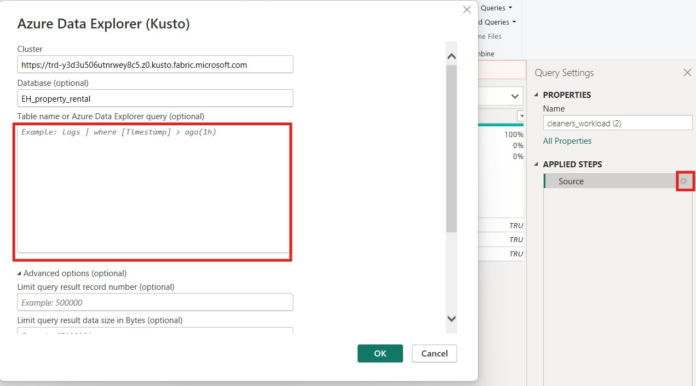

3. Paste KQL query generated previously for `fct_cleaning_schedule`.
4. Do the same steps to create `fct_reservations` and `fct_weekly_summary`.
5. Add relationships and DAX measureas. Go to *TMDL view* and run the [script](./resources/03%20Semantic%20Model/sm-tmdl-script.txt) from  with relationships and measures examples.

## 1.8. Power BI Report with Power Automate

### 1.8.1. Logic
The goal of the Power BI report is to provide clear navigation across the four priority areas our persona focuses on—bringing together key KPIs, concise business summaries (e.g., Copilot Smart Narrative), operational queues and assignments, and customer feedback insights in one place. In this type of solution, maps work very well; you can use the free Azure Maps visual or the paid Synoptic Panel visual if tighter visual integration with the report is desired. The design also allows you to analyze day-to-day operations, optionally integrate with Power Platform (e.g., trigger notifications, capture write-back actions, or launch task assignments), and use AI (Copilot, Q&A) for suggestions and next-best actions. Finally, we account for growth with scalability.

### 1.8.2. Setting up report: page refresh
1. Go to *Visualizations pane* and navigate to report page settings. Enable *Page refresh* and select refresh interval. 
   
   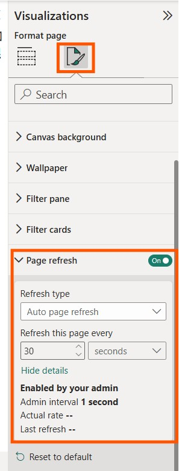

   **Important:** to optimize number of queries sended by your report, you can 

   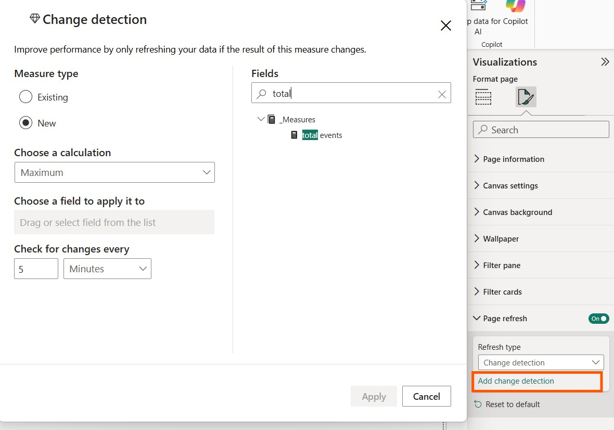

### 1.8.3. Creating visuals

In Power BI Desktop, create visuals by selecting fields from your data model and choosing the appropriate visualization type from the *Visualizations* pane. Customize each visual by adjusting its fields, formatting, and interactions to effectively present key insights.

You can also use **Copilot in Power BI** to automatically suggest and generate visuals based on your data and prompts, helping you build reports faster and with relevant insights.

### 1.8.4. Adding *Narrative* powered by Copilot
1. In Power BI Desktop, select *Narrative* on Visualizations pane.

   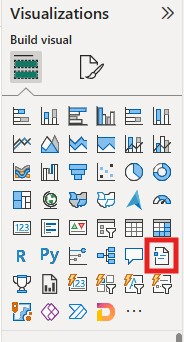

2. Choose a Fabric Capacity and select the visuals you want Copilot to analyze. In our demo, we used the `fct_weekly_summary` table, which is materialized on a separate report page. 

3. Then enter a prompt, for example:
   > This report is for vacation rental manager. You're his assistant. Generate a today's snaphot and summarize briefly occupancy, forward bookings, average daily rates, cancellations, and lease renewals. Focus on weekly performance and trends. Use an optimistic, performance-focused tone. Words limit is 200.

   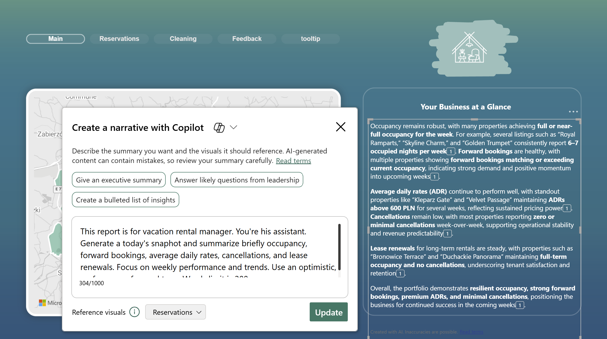

4. The end user will see the following:

   

### 1.8.5. Adding Power Automate Flow:  Real-Time Cleaner Assignment

**Objective:** The goal of this flow is to automatically assign cleaners in real time to apartments that are about to be vacated by guests.

**Flow Overview:**

The report page present data from the `fct_cleaning_schedule` table, which contains upcoming check-outs and cleaning requirements. At the same time, it reads from `cleaning_availability`, which provides information about staff availability. When a specific apartment is selected (e.g., from a Power BI table), there is filtered the list of cleaners available during the corresponding time slot.

A slicer allows the user to further refine the selection and choose a specific cleaner. Once a cleaner is selected, the flow creates an assignment record — linking the employee and apartment (via reservation) that requires cleaning. Finally, the flow sends this assignment to Eventhouse, updating both the staff schedule and the apartment status.

**Result:**
This flow automates the cleaner assignment process, ensuring real-time updates and eliminating manual scheduling. Users can instantly view which cleaners are available and which apartments they have been assigned to.

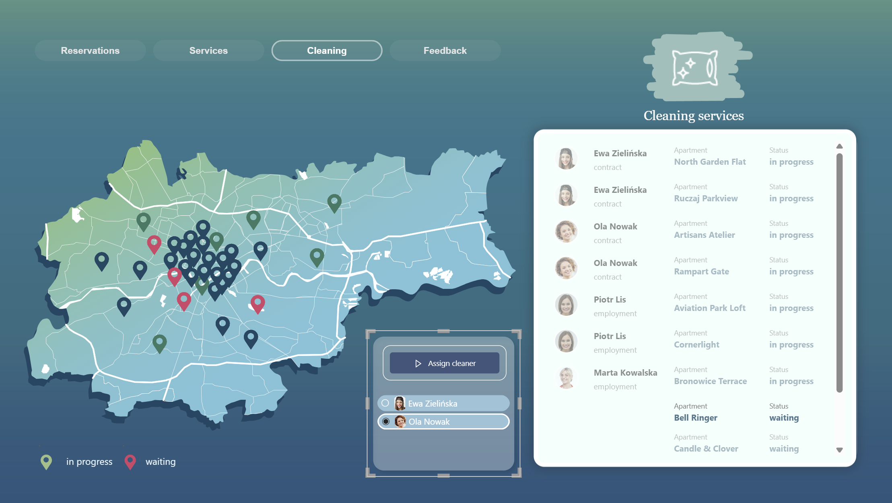

**How to create flow:**

1. In Power BI Desktop, select *Power Automate* on Visualizations pane.

   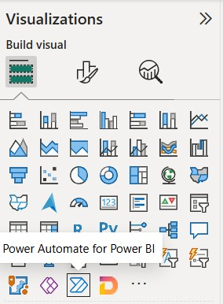

2. Add two measures: `[cleaning employee]` and `[cleaning reservation]` to *Power Automate data* field.
3. Click *Edit* to open Power Automate editor and *+ New*  

   

4. Add step *Compose* 

   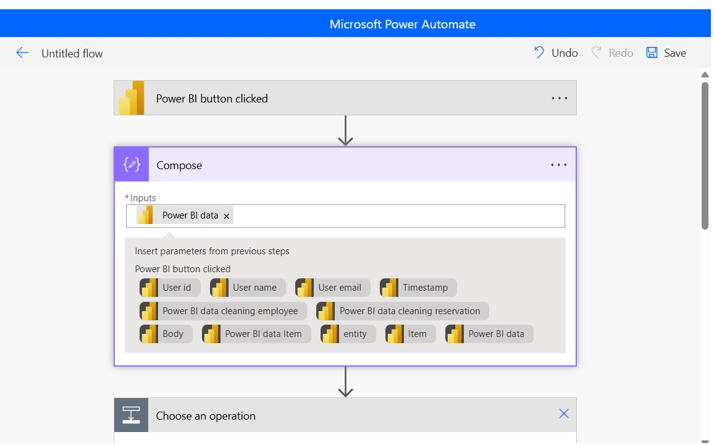

5. Add step *Event Hub* > *Sent event*. Define `json` with fields `reservation_id` and `assigned_cleaner` reffering to your measures. 

   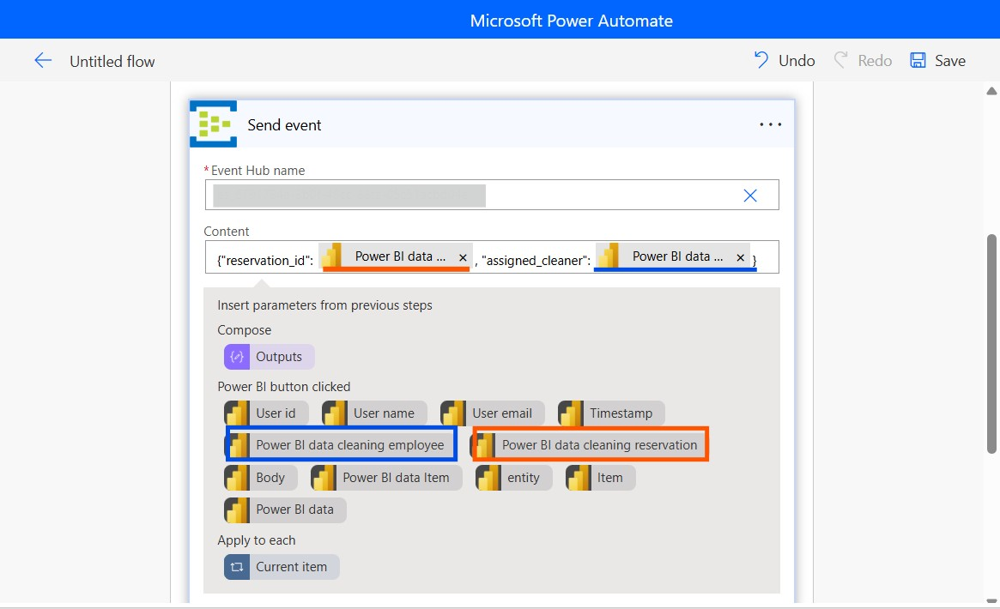

6. Rename your flow and save.  
7. Run the flow.
8. Go to your Eventstream and add new path with steps *Transform* and *Destination* in KQL database (`cleaners_workload`).

   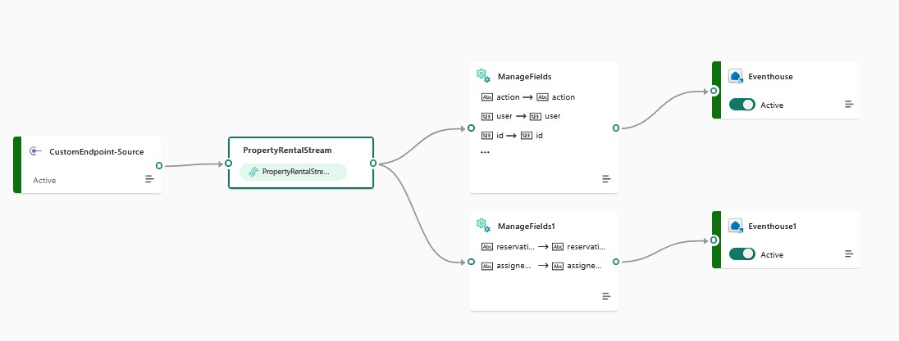

---
## 1.9. Summary 

This use case targets property managers running 30–100+ short- and mid-term rentals who need flexible, real-time operations and deeper analytics than off-the-shelf apps provide. In this scenario we present a focused set of core capabilities first, while recognizing the platform’s wide potential and a rich roadmap for later stages. By unifying diverse data sources and combining live signals with historical and external context (reviews, weather, city events), Microsoft Fabric — especially Real-Time Intelligence and AI — delivers the agility needed today and a scalable foundation for growth. Looking ahead, we see clear opportunities to add AI Language for reviews to power advanced sentiment and aspect-based insights; integrate more deeply with Power Platform to enable notifications, write-back, dynamic staff assignment, and rapid reorganization of cleaning teams when no-shows occur; and leverage Copilot and Q&A so users can ask natural-language questions and get instant explanations and summaries. From experience, every business evolves and seeks new markets and opportunities—Fabric’s scalability and flexibility make it an ideal base for that journey.

---
## 1.10. Authors
- Aleksandra Godlewska - [Github](https://github.com/AleksandraGodlewska) · [LinkedIn](https://www.linkedin.com/in/aleksandra-godlewska-b87032150/)
- Joanna Sękiewicz - [Github](https://github.com/jsekiewicz) · [LinkedIn](https://www.linkedin.com/in/jsekiewicz/)

---
## 1.11. References
- [Microsoft Fabric FabCon Global Hackaton 2025](https://github.com/microsoft/fabcon-global-hack-25)  
- [Azure Functions Documentation](https://learn.microsoft.com/azure/azure-functions)  
- [Power Automate Documentation](https://learn.microsoft.com/power-automate)
- [Webhooks - Smoobu API](https://docs.smoobu.com/#webhooks)
